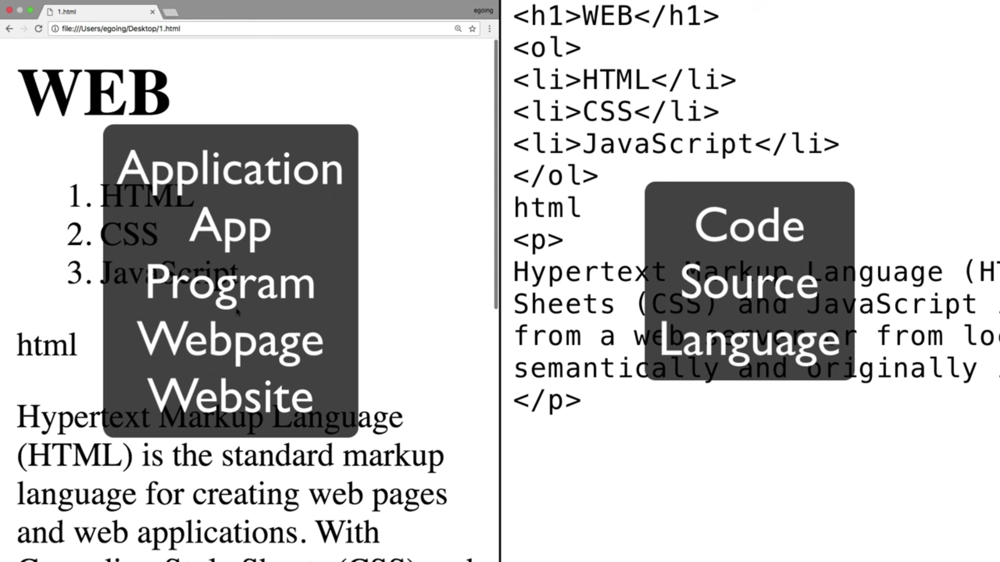
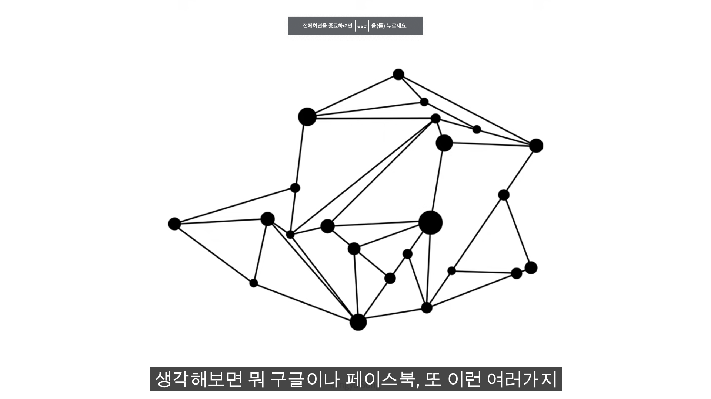
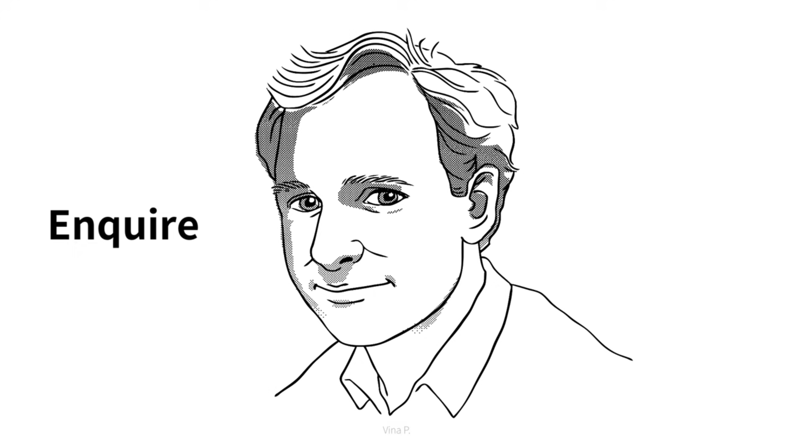
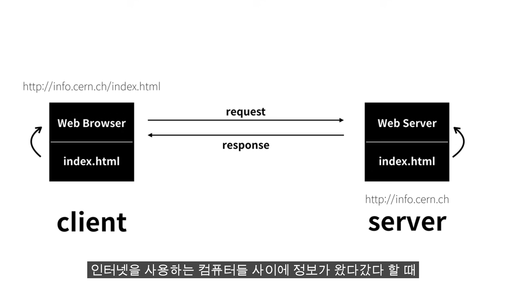
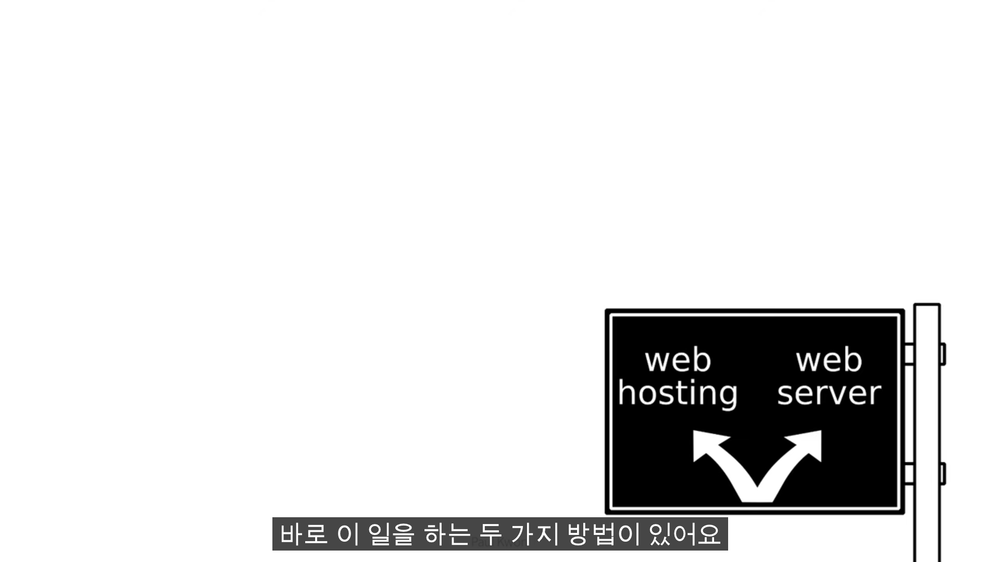
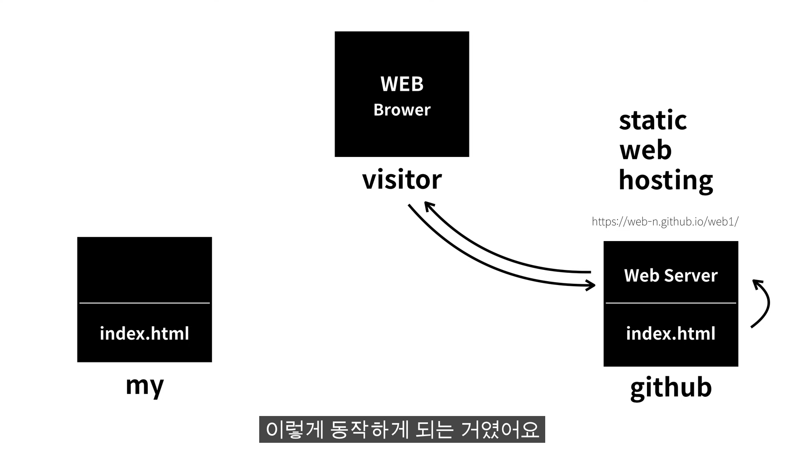
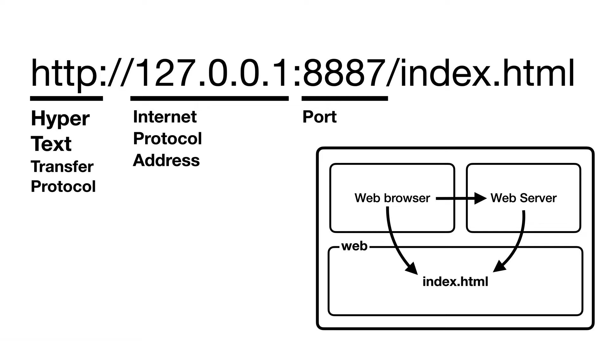
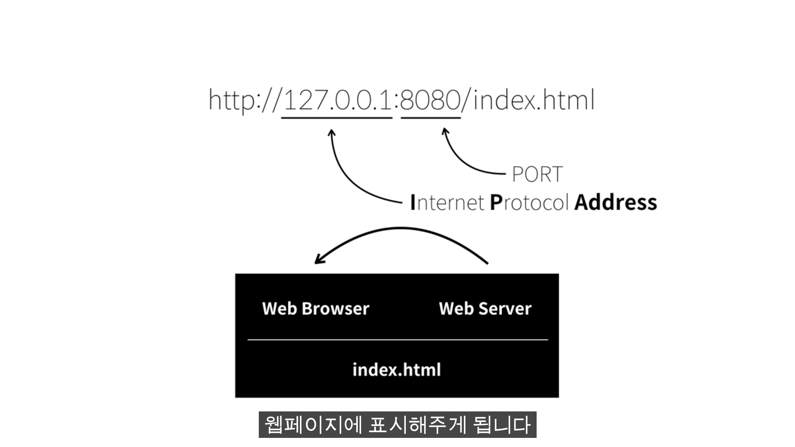

# WEB1 - HTML & 인터넷

# 1일차

- 범위
    1. 수업소개
    2. 프로젝트의 동기
    3. 기획
    4. 코딩과 HTML
    5. HTML 코딩과 실습환경

1~3 생략

## 4. 코딩과 HTML

**기계가 하는 일 vs 사람이 하는 일**

원인인 코드를 통해 결과를 만든다.

**HTML**

모든 웹을 만드는 데에 쓰이는 언어

Public Domain. 저작권이 없음.

## 5. HTML 코딩과 실습 환경

생략

---

# 2일차

- 범위
    1. 기본문법 - 태그
    2. 혁명적인 변화
    3. 통계에 기반한 학습

## 6. 기본문법 - 태그

### 문법

$$
<> </>
$$

### 종류

- 볼드체: `<strong> </strong>`
- 밑줄: `<u> </u>`

## 7. **혁명적인 변화**

- 태그를 배우기 전과 후의 세상은 다르다.
- 놀라운 세상을 낯설게 보기

💡**공식 문서를 보는 방법**

예제를 먼저 보고 뭔지 어렴풋이 알고, 정의를 본다.

## 8. **통계에 기반한 학습**

밑천으로 알고있을만한 태그를 스스로 알 수 있는 방법이다.

[HTML Study | Advanced Web Ranking](https://www.advancedwebranking.com/seo/html-study/)

[https://www.advancedwebranking.com/seo/html-study/](https://www.advancedwebranking.com/seo/html-study/)

---

# 3일차

- 범위
    1. 줄바꿈 br vs p
    2. HTML이 중요한 이유
    3. 최후의 문법 속성 & Img

## 9. 줄바꿈 br vs p

- ` `: 단순 줄 바꿈
- `
 
`: 줄 바꿈 + 단락을 나누는 의미 ⇒ 더 좋음
    - CSS로 단락 간 여백을 정교하게 조정할 수 있음
    - 예) `
`

## 10. **HTML이 중요한 이유**

- ‘제목’ 스타일: <h3>
- 글씨 크기 22p, 강조: <strong></strong>

1. 같지만 완전히 격이 다르다.
2. 검색엔진은 ‘제목’ 태그를 먼저 검색한다.
3. 웹은 접근성이 뛰어난 공공재다. 시각적인 정보를 청각적인 정보로 변환할 때 태그가 중요한 역할을 한다.

## 11. 최후의 문법 속성 & img

태그의 이름만으로는 정보가 부족할 때, 속성을 통해 더 많은 의미를 부가

💡**저작권 무료 이미지 사이트**

[Beautiful Free Images & Pictures | Unsplash](https://unsplash.com/)

---

# 4일차

- 범위
    1. 부모자식과 목록
    2. 문서의 구조와 슈퍼스타들
    3. HTML 태그의 제왕
    

## 12. 부모 자식과 목록

**부모 태그** - 어디서부터 어디까지가 서로 연관된 항목인지를 그루핑 한 것

부모 태그는 자식 태그를, 자식 태그는 부모 태그를 반드시 가진다.

예) 목록 태그: (부모)ul, ol > (자식)li

### 목록

- `<ol> </ol>`: Ordered List
- `<ul> </ul>`: Unordered List
- `<li> </li>`: LIst

## 13. 문서의 구조와 슈퍼스타들

본문은 body 태그 안에, 본문을 설명하는 태그는 head 태그 안에 들어가는 것이 약속.

- `<!doctype html>`: 관용적 태그
- `<html> </html>`: 초고위층 태그. 해당 HTML 문서의 모든 코드를 포함
- `<head> </head>`: 고위층 태그, 본문을 설명하는 부분들을 포함
    - `<title> </title>`: 웹페이지 제목
    - `<meta charset=”utf-8”>`: utf-8(문자 표현 규칙)로 문서를 읽어라.
- `<body> </body>`: 고위층 태그, 본문에 해당하는 내용을 포함

## 14. HTML 태그의 제왕

`<a>`: (앵커) 링크

- HTML 왕국의 제왕
    - 검색엔진이 존재할 수 있는 이유
    - 도시의 길, 인간의 혈관과 같은 것
    - 우리가 하루에 백 번도 넘게 하는 것
    - Hyper Text가 의미하는 것
    - 

**속성**

- `href`: (Hyper, Reference)
- `target`: 링크를 열 곳(새 창, 새 탭 등)
- `title`: 링크에 마우스를 올리면 띄울 내용

---

# 5일차

- 범위
    1. 웹사이트 완성

---

# 6일차

- 범위
    1. 원시웹
    2. 인터넷을 여는 열쇠: 서버와 클라이언트

## 16. 원시웹

- 1960년대: 핵전쟁 이후, 강력한 통신 시스템의 필요성이 대두되며 미국에서 인터넷이 발명됨

- 1990년대에 스위스 유럽입자물리연구소에서 원시웹, 즉 www가 발명됨

💡**원시웹**

[http://info.cern.ch](http://info.cern.ch/)

## 17. 인터넷을 여는 열쇠: 서버와 클라이언트

---

# 7일차

- 범위
    1. 웹호스팅: github page
    

## 18. 웹호스팅: github page

**Host**

웹 서버를 운영하기 위한 컴퓨터

**Web hosting**

웹 호스팅을 대신 해주는 업체들

**static web hosting**

html, css, js 만으로 이루어진 정적인 웹을 호스팅해주는 서비스

### github page 사용법

github 레포 - settings - github pages - Source 설정 후 Save

- **생활코딩 추천 웹호스팅✨**
    
    [Netlify App](http://www.bitballoon.com/)
    
    [Neocities](https://neocities.org/)
    
    Amazon S3
    
    Google Cloud Storage
    
    Azure Blob
    

---

# 8일차

- 범위
    1. 웹서버 운영하기

## 19.1 웹서버 운영하기

### 웹서버

웹서버는 제품군이다.

- 제품명
    - Apache
    - d
    - -
    - web server for Chrome

**html 파일을 직접 열었을 때**

- 주소: file:///~

**웹서버를 통해 접속했을 때**

- 주소: http://~

### http, IP 주소, Port

---

# 9일차

- 범위
    
    19.2 웹서버 설치
    

## 19.2.1 웹서버 설치 (MAC)

### 웹서버 설치 (MAC)

1. bitnami MAMP 설치
2. 응용 프로그램 - mampstack - apache2 - index.html 파일이 실행됨

## 19.2.2 웹서버와 http

### 서버 구동 과정

1. 웹브라우저에 주소 입력
2. 웹브라우저가 IP주소의 컴퓨터 속 포트번호의 웹서버에 index.html 요청
3. 웹서버가 index.html 파일의 코드를 해석해서 웹브라우저에 전송

## 19.2.3 웹브라우저와 웹 서버의 통신

**IP 주소를 알아내는 방법**

시스템 환경설정 - 네트워크 - 고급

**스마트폰으로 웹 서버 접속하기**

스마트폰에 컴퓨터 IP 주소 + 웹 서버 포트 번호 입력
